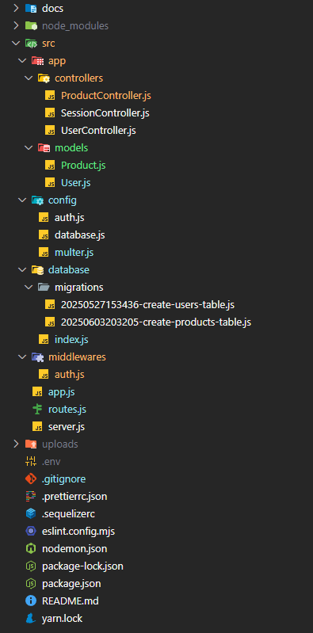

# X Planet Burger API 🍔

API RESTful desenvolvida para gerenciar o cardápio da hamburgueria **X Planet Burger**, com autenticação de usuários e cadastro/listagem de produtos com imagem.

---

## 📁 Estrutura do Projeto



---

## ✅ Funcionalidades Implementadas

- [x] Estrutura inicial com Express
- [x] Middleware para tratar `JSON` (`express.json()`)
- [x] Organização em camadas (controllers, models, config, database)
- [x] Migrations com Sequelize
  - Criação da tabela `users`
  - Criação da tabela `products`
- [x] Cadastro de usuários (`POST /users`)
- [x] Login com validação de senha e retorno de token JWT (`POST /session`)
- [x] Middleware de autenticação com JWT (`authMiddleware`)
- [x] Upload de imagens com Multer (`POST /products`)
- [x] Listagem de produtos (`GET /products`)
- [x] Campo virtual `url` para exibir o caminho da imagem
- [x] Variáveis de ambiente com dotenv (`.env`)

---

## 🔐 Autenticação

- Usuários autenticados recebem um token JWT válido por 5 dias.
- O token é obrigatório para acessar as rotas protegidas:
  - Cadastro de produtos
  - Listagem de produtos
- Configuração armazenada em: `src/config/auth.js`
- Middleware: `src/middlewares/auth.js`
- O token deve ser enviado via header `Authorization: Bearer <token>`

---

## 📦 Models e Tabelas

### 🧑‍💻 `users`
| Campo        | Tipo     | Regras                         |
|--------------|----------|--------------------------------|
| id           | UUID     | Chave primária                 |
| name         | STRING   | Obrigatório                    |
| email        | STRING   | Único, obrigatório             |
| password     | STRING   | Salvo com hash (bcrypt)        |
| admin        | BOOLEAN  | Define se é admin ou não       |


### 🍔 `products`
| Campo        | Tipo     | Regras                         |
|--------------|----------|--------------------------------|
| id           | INTEGER  | Auto incremento, PK            |
| name         | STRING   | Nome do produto                |
| price        | INTEGER  | Preço                          |
| category     | STRING   | Ex: "tradicional", "vegano"    |
| path         | STRING   | Caminho da imagem (Multer)     |
| url (virtual)| VIRTUAL  | Gera a URL acessível da imagem |


---

## 📤 Upload de Imagens

- Configurado com Multer (`src/config/multer.js`)
- Imagens são salvas na pasta `/uploads`
- A rota `POST /products` permite o upload de uma imagem via campo `file`
- As imagens ficam acessíveis via: `http://localhost:3001/product-file`

---

## 🔄 Rotas

| Método | Rota             | Protegida | Descrição                         |
|--------|------------------|-----------|-----------------------------------|
| POST   | /users           | ❌        | Cadastro de usuário               |
| POST   | /session         | ❌        | Login e geração de token JWT      |
| POST   | /products        | ✅        | Cadastrar novo produto (com imagem) |
| GET    | /products        | ✅        | Listar todos os produtos          |

---

## 🛠️ Tecnologias Utilizadas

- Node.js
- Express
- Sequelize (ORM)
- PostgreSQL (banco de dados/Docker)
- Bcrypt (hash de senha)
- JWT (autenticação)
- Multer (upload de arquivos)
- Yup (validação)
- Dotenv (variáveis de ambiente)

---

## 📬 Como rodar o projeto

```bash
# Instale as dependências
yarn install

# Configure as variáveis de ambiente
cp .env.example .env

# Execute as migrations
yarn sequelize db:migrate

# Inicie o servidor
yarn dev
