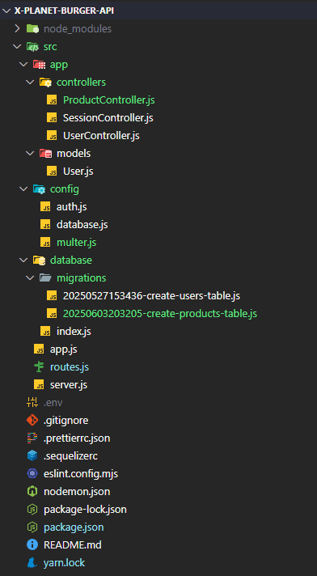

# X Planet Burger API 🍔

API RESTful em desenvolvimento para gerenciar o cardápio da hamburgueria **X Planet Burger**, com autenticação de usuários e cadastro de produtos.

---

## 📁 Estrutura do Projeto




---

## ✅ Funcionalidades Implementadas

- [x] Estrutura inicial com Express
- [x] Middleware para tratar `JSON` (`express.json()`)
- [x] Organização em camadas (controllers, models, config, database)
- [x] Migrations com Sequelize
  - Criação da tabela `users`
  - Criação da tabela `products`
- [x] Cadastro de usuários (`POST /users`)
- [x] Login com validação de senha e retorno de token JWT (`POST /session`)
- [x] Variáveis de ambiente com dotenv (`.env`)
- [x] Multer configurado para upload (a ser utilizado nos produtos)

---

## 🔐 Autenticação

- Usuários autenticados recebem um token JWT válido por 7 dias.
- O token será necessário para acessar rotas protegidas (em breve).
- Configuração armazenada em: `src/config/auth.js`
- Segredos e configs sensíveis protegidos via `.env`

---

## 📦 Models e Tabelas

### 🧑‍💻 `users`
| Campo        | Tipo     | Regras                         |
|--------------|----------|--------------------------------|
| id           | UUID     | Chave primária                 |
| name         | STRING   | Obrigatório                    |
| email        | STRING   | Único, obrigatório             |
| password     | STRING   | Salvo com hash (bcrypt)        |
| admin        | BOOLEAN  | Define se é admin ou não       |
| created_at   | DATE     | Auto gerado                    |
| updated_at   | DATE     | Auto gerado                    |

### 🍔 `products`
| Campo        | Tipo     | Regras                         |
|--------------|----------|--------------------------------|
| id           | INTEGER  | Auto incremento, PK            |
| name         | STRING   | Nome do produto                |
| price        | INTEGER  | Preço em centavos              |
| category     | STRING   | Ex: "tradicional", "vegano"    |
| path         | STRING   | Caminho da imagem              |
| created_at   | DATE     | Auto gerado                    |
| updated_at   | DATE     | Auto gerado                    |

---

## 🛠️ Tecnologias Utilizadas

- Node.js
- Express
- Sequelize (ORM)
- PostgreSQL (banco de dados)
- Bcrypt (hash de senha)
- JWT (autenticação)
- Multer (upload de arquivos)
- Yup (validação)
- Dotenv (variáveis de ambiente)

---

## 📌 Status do Projeto

🚧 Em construção  
🔜 Próximo passo: CRUD de produtos com upload de imagem via Multer

---

## 📬 Como rodar o projeto

```bash
# Instale as dependências
yarn install

# Configure as variáveis de ambiente
cp .env.example .env

# Execute as migrations
yarn sequelize db:migrate

# Inicie o servidor
yarn dev


