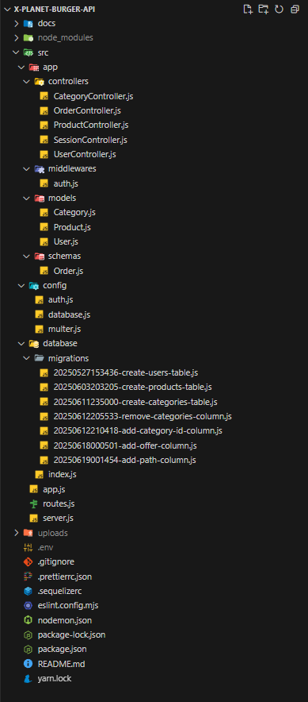

# 🍔 X-Planet Burger API (Futuro "Planeta X Burger e Fliper: Venha saboriar esta nostalgia)

API RESTful robusta e escalável, desenvolvida para gerenciamento completo do cardápio, categorias e pedidos da hamburgueria **X-Planet Burger**.  
Inclui autenticação com JWT, uploads com Multer, persistência em **PostgreSQL** e **MongoDB**, validações com Yup e estrutura modular com Sequelize.

---

## 📁 Estrutura do Projeto



- `src/app/controllers/`: Lógica das rotas (User, Product, Category, Order, Session)
- `src/app/models/`: Models Sequelize (User, Product, Category)
- `src/app/schemas/`: Schemas Mongoose (Order)
- `src/config/`: Configurações de autenticação (`auth.js`), upload (`multer.js`), banco de dados (`database.js`)
- `src/database/`: Migrations e index da conexão
- `src/app/middlewares/`: Middleware de autenticação (`auth.js`)
- `src/routes.js`: Arquivo principal de rotas
- `uploads/`: Imagens salvas via Multer (não versionada - ignorada via `.gitignore`)

---

## ✅ Funcionalidades Implementadas

- [x] Cadastro de usuário com hash de senha (`bcrypt`)
- [x] Login com autenticação JWT
- [x] Middleware para rotas protegidas
- [x] Upload de imagens para produtos e categorias (`multer`)
- [x] Cadastro de produtos com imagem, categoria e oferta
- [x] Edição de produtos com upload e atualização de dados
- [x] Cadastro de categorias com imagem
- [x] Validação de categorias repetidas
- [x] Listagem de produtos e categorias
- [x] Pedido com múltiplos produtos (armazenado no MongoDB)
- [x] Atualização de status de pedido (admin)
- [x] Relação entre produtos e categorias
- [x] Validações com `Yup`
- [x] Organização por camadas

---

## 🧪 Tecnologias Utilizadas

- **Node.js**
- **Express**
- **Sequelize** (ORM - PostgreSQL)
- **Mongoose** (ODM - MongoDB)
- **PostgreSQL**
- **MongoDB**
- **JWT** (autenticação)
- **Multer** (upload de imagens)
- **Yup** (validações)
- **Dotenv** (variáveis de ambiente)
- **UUID** (ID de usuários)

---

## 🧪 Ferramentas utilizadas nos testes

- **Docker**: gerenciamento de containers e bancos (PostgreSQL e MongoDB)
- **Beekeeper Studio**: acesso e manipulação do PostgreSQL
- **MongoDB Compass**: visualização dos dados de pedidos (NoSQL)
- **HTTPie**: testes de rotas no terminal

---

## 🔐 Autenticação

- Autenticação via **JWT**
- Usuários autenticados recebem um token JWT válido por 5 dias.
- O token é necessário para acessar rotas protegidas.
- Configuração armazenada em: `src/config/auth.js`
- Segredos protegidos via `.env
- O token deve ser enviado no header:  
  `Authorization: Bearer SEU_TOKEN_AQUI`

---

## 🛠️ Models & Schemas

### 🧑‍💻 Users (PostgreSQL)

| Campo         | Tipo     | Regras                       |
|---------------|----------|------------------------------|
| id            | UUID     | Chave primária               |
| name          | STRING   | Obrigatório                  |
| email         | STRING   | Único, obrigatório           |
| password_hash | STRING   | Hash da senha (`bcrypt`)     |
| admin         | BOOLEAN  | Define se é admin            |

---

### 🍔 Products (PostgreSQL)

| Campo        | Tipo      | Regras                         |
|--------------|-----------|--------------------------------|
| id           | INTEGER   | Chave primária auto incremento |
| name         | STRING    | Nome do produto                |
| price        | INTEGER   | Preço do produto               |
| offer        | BOOLEAN   | Produto em oferta              |
| path         | STRING    | Caminho da imagem (upload)     |
| category_id  | INTEGER   | FK para categoria              |
| url          | VIRTUAL   | URL pública da imagem          |

---

### 🗂️ Categories (PostgreSQL)

| Campo        | Tipo    | Regras                         |
|--------------|---------|--------------------------------|
| id           | INTEGER | PK auto incremento             |
| name         | STRING  | Nome único e obrigatório       |
| path         | STRING  | Imagem (upload)                |
| url          | VIRTUAL | URL da imagem pública          |

---

### 🧾 Orders (MongoDB)

| Campo     | Tipo     | Regras                                    |
|-----------|----------|-------------------------------------------|
| user      | Object   | ID e nome do usuário                      |
| products  | Array    | Lista com produtos, quantidades e preços  |
| status    | STRING   | `Pedido Realizado`, `Em preparo`, etc.    |

---

## 🚀 Rotas da API

### 🔓 Públicas

- `POST /users` → Cadastro de usuário
- `POST /session` → Login (retorna token JWT)

---

### 🔐 Privadas (requer token)

#### 📦 Produtos
- `POST /products` → Criar produto (admin)
- `GET /products` → Listar produtos
- `PUT /products/:id` → Atualizar produto(admin)

#### 🗂️ Categorias
- `POST /categories` → Criar categoria (admin)
- `GET /categories` → Listar categorias 
- `PUT /categories/:id` → Atualizar categoria (admin)

#### 🧾 Pedidos
- `POST /orders` → Criar pedido
- `GET /orders` → Listar pedidos (admin)
- `PUT /orders/:id` → Atualizar status (admin)

---

## 📌 Status do Projeto

✅ **API Finalizada** 
💬 Totalmente funcional com segurança e escalabilidade  
📦 Sistema de categorias, produtos, usuários e pedidos prontos  
🔐 Autenticação protegendo rotas  
🖼️ Uploads funcionando com `Multer`  
🧩 Integração com MongoDB finalizada

---


## 🔮 Futuras Melhorias

🚀 **Interface** 🚀
- Integração com frontend em React
- Filtro de produtos por categoria
- Busca por nome
- Dashboard para admin
- Entre outras funcionalidades, vou atualizando conforme desenvolvimento

---

## 📬 Como rodar o projeto

```bash
# Instalar dependências
yarn install

# Configurar variáveis de ambiente
cp .env.example .env
# e edite o arquivo com suas credenciais

# Criar tabelas no PostgreSQL
yarn sequelize db:migrate

# Iniciar servidor
yarn dev
